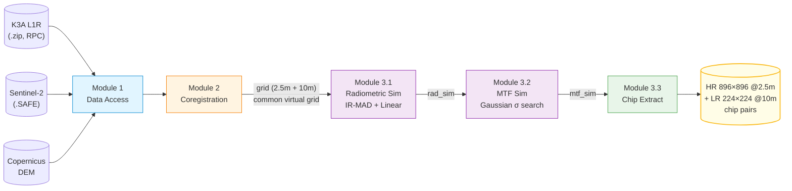

<div align="center">

# K3A_S2_MTF

### Kompsat-3A → Sentinel-2 Radiometric & MTF Simulation Pipeline

**A reproducible pipeline that simulates Sentinel-2 radiometric and optical characteristics on Kompsat-3A imagery, producing aligned LR/HR chip pairs ready for super-resolution training.**

[](https://www.python.org/)
[](https://gdal.org/)
[](https://rasterio.readthedocs.io/)
[](#)

[English](README.en.md) · [한국어](README.md)

</div>

---

## 📖 Overview

This project transforms **Kompsat-3A (K3A, 2.5 m)** imagery from KARI to match the radiometric and optical properties of **Sentinel-2 (S2, 10 m)** from ESA. The final output is a set of precisely co-registered chip pairs — **K3A original (HR, 2.5 m)** paired with the **S2-simulated K3A (LR, 10 m)** — that can be dropped directly into a super-resolution training loop.

### Why this pipeline
- **No real LR/HR pairs exist**: K3A and S2 differ in sensor, orbit and acquisition time. Naively downsampling K3A does not capture the actual S2 PSF or radiometric response.
- **Statistical simulation as a substitute**: apply (a) radiometric normalization and (b) an estimated PSF to K3A. After 4× downsampling, the result is statistically and spatially comparable to the corresponding S2 acquisition.
- **Result**: from a single K3A↔S2 acquisition pair, the pipeline yields tens to hundreds of training-ready LR/HR chips that share the exact same ground footprint.

---

## 🔭 Pipeline Flow



| Stage | Input | Output | Core Algorithm |
|---|---|---|---|
| **Module 1** | `.zip`, `.SAFE`, DEM | extracted scenes + metadata | RPC sidecar parsing, Aux.xml parsing |
| **Module 2** | K3A + S2 + DEM | aligned virtual-grid pair | `gdal.Warp` RPC + DEM, common-origin virtual grid |
| **Module 3.1** | K3A·S2 grid | radiometrically simulated K3A | IR-MAD (Iteratively Reweighted MAD) + linear regression |
| **Module 3.2** | rad_sim K3A | MTF-simulated K3A | Gaussian σ MSE minimization + phase-correlation fallback |
| **Module 3.3** | mtf_sim + grid | LR/HR chip pairs | 1/3-overlap sliding window, valid-ratio filter |

---

## 🚀 Quick Start

### Environment

GDAL/JP2 driver compatibility on Windows is fragile — we **strongly recommend a single-shot conda-forge install**. Mixing pip GDAL with conda rasterio leads to DLL ABI mismatches.

```bash
conda create -n gongjong -c conda-forge \
    python=3.11 \
    gdal rasterio libgdal-jp2openjpeg openjpeg \
    numpy scipy scikit-image matplotlib \
    python-dotenv requests
conda activate gongjong
```

### Copernicus credentials
Add to `.env`:
```
COPERNICUS_USERNAME=your_email
COPERNICUS_PASSWORD=your_password
```

### Data layout
```
data/raw/
  ├── k3a/   *.zip          # K3A L1R archives
  ├── s2/    *.SAFE         # Sentinel-2 L1C SAFE directories
  └── dem/   *.tif          # Copernicus DEM (auto-fetched if missing)
```

### Running the full pipeline
```bash
# 1. Co-register K3A to S2 on a common virtual grid
python module2_coregistration/scripts/run_coregistration.py

# 2. Radiometric simulation (IR-MAD + linear regression)
python module3_simulation/scripts/run_simulation.py

# 3. MTF simulation (Gaussian PSF σ search)
python module3_simulation/scripts/run_mtf_simulation.py

# 4. Extract LR/HR chip pairs (HR 896×896 / LR 224×224)
python module3_simulation/scripts/run_chip_extraction.py
```

Each stage is **per-pair idempotent** — completed pairs are auto-skipped on re-run, so any interruption is safe.

---

## 🗂 Project Structure

```
K3A_S2_MTF/
├── claude.md                          # Coding guidelines + known issues
├── config/
│   ├── paths.json                     # Single source of truth for paths
│   ├── processing_params.json         # Algorithm hyperparameters
│   └── sensor_specs.json              # K3A/S2 sensor specifications
├── docs/
│   └── development_log.md             # Dated development log
│
├── module1_data_download/             # Input data access
│   └── src/
│       ├── k3a_loader.py              # K3A zip → metadata + band map
│       ├── s2_download.py             # Copernicus search & download
│       ├── dem_download.py            # DEM auto-fetch + cache
│       └── raster_io.py               # Shared GeoTIFF I/O
│
├── module2_coregistration/            # Spatial registration
│   ├── src/
│   │   ├── rpc.py                     # RPC sidecar discovery & parse
│   │   ├── ortho.py                   # gdal.Warp + RPC + DEM
│   │   ├── grid.py                    # Common virtual grid (2.5m + 10m)
│   │   └── pipeline.py                # 4-step orchestrator
│   └── scripts/run_coregistration.py
│
├── module3_simulation/                # Radiometric + MTF + chip extraction
│   ├── src/
│   │   ├── ir_mad.py                  # IR-MAD CCA iterations
│   │   ├── linear_norm.py             # PIF-based linear regression
│   │   ├── pipeline.py                # Radiometric simulation entry
│   │   └── mtf.py                     # PSF σ search + phase-correlation fallback
│   └── scripts/
│       ├── run_simulation.py          # Radiometric simulation batch
│       ├── run_mtf_simulation.py      # MTF simulation batch
│       ├── run_chip_extraction.py     # Chip extraction batch
│       └── triage_failures.py         # Failure-pair diagnostics
│
├── module4_webapp/                    # Visualization web app (planned)
│
├── shared/utils/                      # Project-wide utilities
│   ├── paths.py                       # paths.json loader
│   └── proj_env.py                    # GDAL/PROJ env init (import side effect)
│
└── data/
    ├── raw/         {k3a, s2, dem}    # Source inputs (gitignored)
    ├── interim/     {ortho, grid}     # Intermediate products
    └── output/      {rad_sim, mtf_sim, chips}  # Final products
```

---

## 🧠 Key Design Decisions

### 1️⃣ Common Virtual Grid
Both rasters are reprojected onto a single shared origin so that **one S2 pixel = a 4×4 block of K3A pixels** exactly.
```
Common origin = top-left corner of the K3A∩S2 intersection bbox (UTM, no snapping)
S2 grid:  exact 10 m pixels
K3A grid: exact 2.5 m pixels, dim = S2 × 4 in each axis
```
**Trade-off**: the outer rectangle is not anchored to the natural UTM 10 m grid, so S2 native pixels suffer a 0–10 m bilinear shift. We chose this over inward HLS-style snapping to preserve edge data.

### 2️⃣ IR-MAD–driven PIF Detection
Two acquisitions differ in season, atmosphere and illumination. **IR-MAD (Iteratively Reweighted Multivariate Alteration Detection)** automatically finds Pseudo-Invariant Features by iterating canonical-correlation analysis with χ² CDF reweighting. Pixels with `no_change_prob ≥ 0.95` form the regression mask.

### 3️⃣ Multi-stage σ Optimization with Phase-Correlation Fallback
The MTF simulator searches the Gaussian σ that minimizes the MSE between blurred-and-downsampled K3A and S2 patches:
1. **Patch selection** — auto-pick the 500×500 (10 m) patch with 100 % validity and the highest variance (edge contrast).
2. **σ search** — `scipy.optimize.minimize_scalar` with progressively relaxed percentile cutoffs `[95 → 30]` to handle outliers.
3. **Phase-correlation fallback** — if σ keeps hitting the boundary, run `phase_cross_correlation` to measure sub-pixel misregistration, physically shift the K3A patch, and re-optimize.

This fallback recovers cases where leftover registration error would otherwise corrupt σ.

### 4️⃣ NoData Bleed Suppression (`normalized_gaussian_filter`)
Standard Gaussian blur treats NoData (= 0) pixels as legitimate zero values, darkening the borders. We use a normalized convolution:
```python
out = gaussian_filter(V * mask) / gaussian_filter(mask)
```
which is mathematically immune to NoData bleeding.

### 5️⃣ Pair Labeling
Co-registration outputs are prefixed `{N}_` where N is the K3A scene index. The same N is applied to both the K3A and the S2 grid output, so pair membership is visible from a directory listing. Skipped scenes leave gaps in the numbering — instant visual triage.

---

## 📊 Data Specification

### Inputs
| Source | Resolution | Bands | Notes |
|---|---|---|---|
| **K3A L1R** | 2.5 m (PAN: 0.55 m) | B / G / R / NIR + PAN + SWIR | RPC sidecar + Aux.xml |
| **Sentinel-2 L1C** | 10 m (B02/03/04/08) | Blue / Green / Red / NIR | TOA reflectance ×10000 |
| **Copernicus DEM** | 30 m | single band | elevation reference for ortho |

### Output Chip Pairs
| Chip | Size | Resolution | Footprint | Bands |
|---|---|---|---|---|
| **HR (Ground Truth)** | 896 × 896 | 2.5 m | 2240 × 2240 m | 4 (B / G / R / NIR) |
| **LR (S2-simulated)** | 224 × 224 | 10 m | 2240 × 2240 m | 4 (B / G / R / NIR) |

**Exactly 4:1 ratio, identical footprint, identical CRS, pixel-grid aligned.**

Each chip ships with a JSON sidecar:
```json
{
  "pair_label": "10",
  "scene_stem": "K3A_20161012043841_08557_00022455_L1R",
  "chip_id": "y02400_x02400",
  "bbox_utm": [xmin, ymin, xmax, ymax],
  "crs": "EPSG:32652",
  "valid_ratio_hr": 0.987,
  "hr": {"size": [896, 896], "transform": [...], ...},
  "lr": {"size": [224, 224], "transform": [...], ...}
}
```

---

## 🔧 Configuration

### `config/paths.json`
All paths are relative to project root. Every script resolves them with `PROJECT_ROOT + paths.json`, so scripts work regardless of CWD.
```json
{
  "k3a_raw_dir": "data/raw/k3a",
  "s2_raw_dir": "data/raw/s2",
  "dem_raw_dir": "data/raw/dem",
  "ortho_dir": "data/interim/ortho",
  "grid_dir": "data/interim/grid",
  "rad_sim_dir": "data/output/rad_sim",
  "mtf_sim_dir": "data/output/mtf_sim",
  "chips_dir": "data/output/chips"
}
```

### Key CLI options
| Script | Option | Default |
|---|---|---|
| `run_coregistration.py` | `--max-date-diff` | 30 days |
| `run_simulation.py` | `--pif-threshold`, `--max-iter` | 0.95, 50 |
| `run_mtf_simulation.py` | `--sigma-min`, `--sigma-max` | 0.05, 9.0 |
| `run_chip_extraction.py` | `--lr-size`, `--stride-lr`, `--valid-threshold` | 224, 150, 0.8 |

---

## ⚠️ Known Issues & Environment Notes

The full incident log is in [`claude.md`](claude.md) §7. Highlights:

1. **GDAL JP2OpenJPEG DLL load failure** — `--force-reinstall` is often insufficient. Recreate the conda env from scratch and install GDAL + plugins + dependencies in a single conda-forge command.
2. **rasterio + RPC + DEM** — `RPC_DEM` is *not* a Warp option; it's a **transformer option**. Pass it via `gdal.Warp(transformerOptions=[...])`, not as a `**kwargs` to `rasterio.warp.reproject`.
3. **K3A scenes with `_M_rpc.txt` only** — GDAL only recognizes RPC sidecars whose stem matches the TIF stem exactly. The pipeline auto-copies `_M_rpc.txt` to band-specific names (`module2_coregistration/src/ortho.py`).
4. **rasterio `UnicodeDecodeError` on Korean Windows** — usually a symptom of issue #1, not a real decoding bug. Fix the GDAL install instead of patching rasterio.
5. **NoData = 0 policy** — accepts the ≈0.024 % loss of legitimate 0-valued K3A 12-bit DN pixels in exchange for simpler footprint masking.

---

## 🛣 Roadmap

- [ ] **L1C → L2A atmospheric correction** to feed cleaner radiometric simulation inputs
- [ ] **Multi-MGRS-tile mosaic** for K3A scenes that straddle Sentinel-2 tile boundaries (`gdal.BuildVRT`)
- [ ] **Single-pass K3A warp** — fold RPC ortho + virtual-grid reprojection into one `gdal.Warp` call to halve interpolation loss
- [ ] **Geometric accuracy validation** — RMSE against GCPs or S2 tie-points
- [ ] **`module4_webapp`** — pair/chip visualizer with σ and R² distributions
- [ ] **Training-loop integration** — PyTorch DataLoader + baseline SR models (RCAN / Real-ESRGAN)

---

## 📦 Current Status (2026-05-10)

| Stage | Result |
|---|---|
| Source K3A archives | 3 (Seoul / Daejeon / Gimjae), 35 scenes after extraction |
| Sentinel-2 SAFE | 12 |
| Co-registered pairs | **31** |
| Radiometric simulation success | **30** / 31 |
| MTF simulation success | **30** / 30 |
| Chip extraction | in progress (~5 GB expected) |

---

## 🙏 Sources & Acknowledgments

- **K3A imagery**: [Korea Aerospace Research Institute (KARI)](https://www.kari.re.kr/) / [Kompsat-3A program](https://www.kompsat.kari.re.kr/)
- **Sentinel-2 imagery**: [ESA Copernicus Data Space](https://dataspace.copernicus.eu/)
- **DEM**: Copernicus DEM by ESA / Airbus
- **IR-MAD**: Nielsen, A.A. (2007). *The Regularized Iteratively Reweighted MAD Method for Change Detection in Multi- and Hyperspectral Data.* IEEE Trans. Image Processing 16(2), 463–478.

---

## 📁 License & Citation

The code is released for research purposes. Licenses for the external datasets (K3A, S2, DEM) follow the policies of their respective providers.

---

<div align="center">

📄 [Development Log](docs/development_log.md) · 🛠 [Coding Guidelines](claude.md) · 🌐 [한국어](README.md)

</div>
