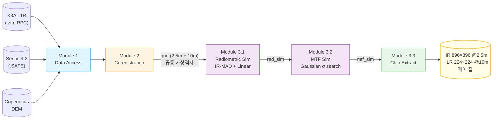

<div align="center">

# K3A_S2_MTF

### Kompsat-3A → Sentinel-2 방사·공간 모사 파이프라인

**고해상도 K3A 위성영상을 Sentinel-2 의 방사·광학 특성으로 모사하여, 초해상화(Super-Resolution) 학습 데이터셋을 자동 생성합니다.**

[](https://www.python.org/)
[](https://gdal.org/)
[](https://rasterio.readthedocs.io/)
[](#)

[English](README.en.md) · [한국어](README.md)

</div>

---

## 📖 개요

본 프로젝트는 KARI 의 **Kompsat-3A (K3A, 2.5m 해상도)** 위성영상을 ESA 의 **Sentinel-2 (S2, 10m 해상도)** 와 같은 방사·광학적 특성을 갖도록 변환하는 파이프라인입니다.
최종 산출물은 **K3A 원본 (HR, 2.5m)** 과 **S2-모사된 K3A (LR, 10m)** 의 정밀하게 정렬된 페어 칩 — Super-Resolution 모델 학습에 바로 사용 가능한 형태로 자동 생성됩니다.

### 왜 만들었나
- **실측 LR/HR 페어의 부재**: K3A 와 S2 는 다른 센서·궤도·시기 — 단순히 K3A 를 다운샘플링한 가짜 LR 은 실제 S2 의 PSF·방사 특성을 반영하지 못함.
- **대안: 통계적 모사**: K3A 에 (a) 방사 정규화 + (b) 추정된 PSF 적용 → 4× 다운샘플 시 S2 와 통계적·공간적으로 동등한 영상 생성.
- **결과**: 같은 영역 K3A·S2 페어 한 쌍에서 수십 ~ 수백 개의 학습용 LR/HR 칩 페어 자동 추출.

---

## 🔭 파이프라인 흐름



| 단계 | 입력 | 출력 | 핵심 알고리즘 |
|---|---|---|---|
| **Module 1** | `.zip`, `.SAFE`, DEM | 추출 + 메타데이터 | RPC 사이드카 파싱, Aux.xml 파싱 |
| **Module 2** | K3A + S2 + DEM | 정렬된 가상격자 페어 | `gdal.Warp` RPC + DEM, 공통 origin 가상격자 |
| **Module 3.1** | K3A·S2 grid | 방사모사 K3A | IR-MAD (Iteratively Reweighted MAD) + 선형회귀 |
| **Module 3.2** | rad_sim K3A | MTF 모사 K3A | Gaussian σ MSE 최소화 + Phase Correlation fallback |
| **Module 3.3** | mtf_sim + grid | LR/HR 페어 칩 | 1/3 중첩 슬라이딩, valid-ratio 필터 |

---

## 🚀 빠른 시작

### 환경 구축
GDAL/JP2 드라이버 호환성 때문에 **conda-forge 통합 설치를 강력 권장**합니다 (pip + GDAL DLL 충돌 사례 다수).

```bash
conda create -n gongjong -c conda-forge \
    python=3.11 \
    gdal rasterio libgdal-jp2openjpeg openjpeg \
    numpy scipy scikit-image matplotlib \
    python-dotenv requests
conda activate gongjong
```

### Copernicus 인증
`.env` 파일에 자격증명 등록:
```
COPERNICUS_USERNAME=your_email
COPERNICUS_PASSWORD=your_password
```

### 데이터 배치
```
data/raw/
  ├── k3a/   *.zip                 # K3A L1R 원본
  ├── s2/    *.SAFE                # Sentinel-2 L1C SAFE
  └── dem/   *.tif                 # Copernicus DEM (자동 다운로드 가능)
```

### 실행 (전체 파이프라인)
```bash
# 1. 공간 정합 (K3A 정사보정 + S2 와 공통 격자 생성)
python module2_coregistration/scripts/run_coregistration.py

# 2. 방사 모사 (IR-MAD + 선형회귀)
python module3_simulation/scripts/run_simulation.py

# 3. MTF 모사 (가우시안 PSF σ 탐색)
python module3_simulation/scripts/run_mtf_simulation.py

# 4. 학습용 칩 추출 (HR 896×896 / LR 224×224)
python module3_simulation/scripts/run_chip_extraction.py
```

각 단계는 **개별 페어 단위로 idempotent** — 중간에 중단되어도 재실행 시 완료된 페어는 자동 스킵.

---

## 🗂 프로젝트 구조

```
K3A_S2_MTF/
├── claude.md                          # 코딩 가이드라인 + 알려진 이슈
├── config/
│   ├── paths.json                     # 모든 경로 단일 소스
│   ├── processing_params.json         # 알고리즘 하이퍼파라미터
│   └── sensor_specs.json              # K3A/S2 센서 사양
├── docs/
│   └── development_log.md             # 날짜별 진행 로그
│
├── module1_data_download/             # 입력 데이터 접근
│   └── src/
│       ├── k3a_loader.py              # K3A zip → 메타·밴드 매핑
│       ├── s2_download.py             # Copernicus 검색·다운로드
│       ├── dem_download.py            # DEM 자동 다운로드 + 캐싱
│       └── raster_io.py               # 공통 GeoTIFF I/O
│
├── module2_coregistration/            # 공간 정합
│   ├── src/
│   │   ├── rpc.py                     # RPC 사이드카 탐색·파싱
│   │   ├── ortho.py                   # gdal.Warp + RPC + DEM
│   │   ├── grid.py                    # 공통 가상격자 (2.5m + 10m)
│   │   └── pipeline.py                # 4단계 오케스트레이터
│   └── scripts/run_coregistration.py
│
├── module3_simulation/                # 방사·MTF 모사 + 칩 추출
│   ├── src/
│   │   ├── ir_mad.py                  # IR-MAD CCA 반복
│   │   ├── linear_norm.py             # PIF 기반 선형회귀
│   │   ├── pipeline.py                # 방사모사 통합
│   │   └── mtf.py                     # PSF σ 추정 + Phase Correlation fallback
│   └── scripts/
│       ├── run_simulation.py          # 방사모사 배치
│       ├── run_mtf_simulation.py      # MTF 모사 배치
│       ├── run_chip_extraction.py     # 칩 추출 배치
│       └── triage_failures.py         # 실패 페어 진단
│
├── module4_webapp/                    # 시각화 웹앱 (예정)
│
├── shared/utils/                      # 모든 모듈 공통 유틸리티
│   ├── paths.py                       # paths.json 로딩
│   └── proj_env.py                    # GDAL/PROJ 환경 초기화 (side effect)
│
└── data/
    ├── raw/         {k3a, s2, dem}    # 입력 원본 (gitignore)
    ├── interim/     {ortho, grid}     # 중간 산출물
    └── output/      {rad_sim, mtf_sim, chips}  # 최종 산출물
```

---

## 🧠 핵심 설계 결정

### 1️⃣ 공통 가상 격자 (Common Virtual Grid)
K3A·S2 두 영상을 한 origin·outer rect 에서 동시에 생성. **S2 1셀 = K3A 4×4 셀** 의 정확한 4:1 비율 보장.
```
공통 origin = K3A∩S2 교집합 좌상단 (UTM, snap 없음)
S2 격자: 10m 정확 픽셀
K3A 격자: 2.5m 정확 픽셀, 셀 수 = S2 × 4
```
**트레이드오프**: outer rect 가 UTM 자연격자에 anchor 되지 않아 S2 native 픽셀이 0~10m bilinear 시프트됨 — 모서리 데이터 보존 우선.

### 2️⃣ IR-MAD 기반 PIF 자동 탐지
계절·대기·조명 차이가 있는 두 영상에서 **불변 픽셀(Pseudo-Invariant Features)** 만 추출해 회귀 학습. χ² CDF 보수로 픽셀별 불변 확률 산출, `≥0.95` 만 PIF.

### 3️⃣ 다단계 σ 최적화 + Phase Correlation Fallback
MTF 모사의 핵심: K3A 에 가우시안 블러 → 4× 다운샘플 → S2 와 robust MSE 최소화.
- **1단계**: 100% valid + 최대 분산 패치 자동 선택 (500×500 @ 10m)
- **2단계**: percentile cutoff `[95→30]` 단계적 완화로 σ 최적화
- **3단계 (fallback)**: σ 가 경계에 갇히면 `phase_cross_correlation` 으로 sub-pixel shift 측정 → K3A 패치 물리 이동 후 재최적화

이 fallback 덕분에 정합 잔차로 인한 σ 추정 실패를 자동 복구.

### 4️⃣ NoData 블리딩 차단 (`normalized_gaussian_filter`)
일반 가우시안 블러는 NoData=0 픽셀을 valid 0 으로 취급해 가장자리에서 어두워짐. 정규화 패턴으로 수학적 차단:
```python
out = gaussian_filter(V * mask) / gaussian_filter(mask)
```

### 5️⃣ 페어 라벨링
정합 결과 파일명 prefix `{N}_` — 같은 N 을 K3A·S2 두 출력에 부여. 스킵된 씬은 빈 번호로 남아 어느 페어가 처리/실패했는지 한눈에 식별 가능.

---

## 📊 데이터 명세

### 입력
| 데이터 | 해상도 | 밴드 | 비고 |
|---|---|---|---|
| **K3A L1R** | 2.5m (PAN: 0.55m) | B/G/R/NIR + PAN + SWIR | RPC 사이드카 + Aux.xml |
| **Sentinel-2 L1C** | 10m (B02/03/04/08) | Blue/Green/Red/NIR | TOA reflectance ×10000 |
| **Copernicus DEM** | 30m | 단일 | 정사보정 Z 기준 |

### 출력 칩 페어
| 칩 | 크기 | 해상도 | Footprint | 밴드 |
|---|---|---|---|---|
| **HR (Ground Truth)** | 896 × 896 | 2.5 m | 2240 × 2240 m | 4 (B/G/R/NIR) |
| **LR (S2-모사)** | 224 × 224 | 10 m | 2240 × 2240 m | 4 (B/G/R/NIR) |

**비율 4:1, 동일 footprint, 동일 CRS, 픽셀 격자 정렬됨.**

각 칩에 동봉되는 메타 JSON:
```json
{
  "pair_label": "10",
  "scene_stem": "K3A_20161012043841_08557_00022455_L1R",
  "chip_id": "y02400_x02400",
  "bbox_utm": [xmin, ymin, xmax, ymax],
  "crs": "EPSG:32652",
  "valid_ratio_hr": 0.987,
  "hr": {"size": [896, 896], "transform": [...], ...},
  "lr": {"size": [224, 224], "transform": [...], ...}
}
```

---

## 🔧 설정

### `config/paths.json`
프로젝트 루트 기준 상대경로 — 모든 스크립트가 `PROJECT_ROOT + paths.json` 으로 절대경로 해석.
```json
{
  "k3a_raw_dir": "data/raw/k3a",
  "s2_raw_dir": "data/raw/s2",
  "dem_raw_dir": "data/raw/dem",
  "ortho_dir": "data/interim/ortho",
  "grid_dir": "data/interim/grid",
  "rad_sim_dir": "data/output/rad_sim",
  "mtf_sim_dir": "data/output/mtf_sim",
  "chips_dir": "data/output/chips"
}
```

### 핵심 CLI 옵션
| 스크립트 | 옵션 | 기본값 |
|---|---|---|
| `run_coregistration.py` | `--max-date-diff` | 30일 |
| `run_simulation.py` | `--pif-threshold`, `--max-iter` | 0.95, 50 |
| `run_mtf_simulation.py` | `--sigma-min`, `--sigma-max` | 0.05, 9.0 |
| `run_chip_extraction.py` | `--lr-size`, `--stride-lr`, `--valid-threshold` | 224, 150, 0.8 |

---

## ⚠️ 알려진 이슈 / 환경 노트

전체 이슈·해결 방법은 [`claude.md`](claude.md) §7 참조. 핵심 요약:

1. **GDAL JP2OpenJPEG DLL 로드 실패** — conda-forge 본체+plugin 을 한 번에 설치해야 함 (`--force-reinstall` 부족).
2. **rasterio + RPC + DEM**: `RPC_DEM` 은 Warp options 가 아닌 **Transformer options** → `gdal.Warp(transformerOptions=[...])` 직접 사용 필수.
3. **K3A `_M_rpc.txt` only 씬**: stem 매칭 사이드카 자동 복사 (`module2_coregistration/src/ortho.py`).
4. **한국어 윈도우 + GDAL**: `UnicodeDecodeError` 는 대개 #1 의 증상 — 디코딩 패치 말고 원인을 잡을 것.
5. **NoData=0 정책**: K3A 12-bit DN 의 valid 0 (≈0.024%) 손실 감수, footprint 마스킹 단순화.

---

## 🛣 로드맵

- [ ] **L1C → L2A 대기보정** 파이프라인 추가 (방사모사 입력 정확도 향상)
- [ ] **다중 MGRS 타일 모자이크**: K3A 가 S2 타일 경계에 걸치는 씬 처리 (`gdal.BuildVRT`)
- [ ] **K3A double bilinear 1회화**: RPC ortho + 가상격자 reproject 통합으로 보간 손실 절반 감소
- [ ] **정사보정 위치정확도 검증**: GCP 또는 S2 매칭 기반 RMSE 측정
- [ ] **`module4_webapp`**: 페어/칩 시각화 + σ·R² 분포 대시보드
- [ ] **모델 학습 파이프라인 통합**: PyTorch DataLoader + SR 모델 (RCAN/Real-ESRGAN) 베이스라인

---

## 📦 처리 현황 (2026-05-10 기준)

| 단계 | 결과 |
|---|---|
| K3A 원본 (zip) | 3개 (Seoul / Daejeon / Gimjae), 추출 35씬 |
| S2 SAFE | 12개 |
| 정합 페어 (성공) | **31** |
| 방사모사 (성공) | **30** / 31 |
| MTF 모사 (성공) | **30** / 30 |
| 칩 페어 추출 | 진행 중 (~5 GB 예상) |

---

## 🙏 출처 및 감사

- **K3A 데이터**: [한국항공우주연구원 (KARI)](https://www.kari.re.kr/) / [아리랑3A호 위성영상](https://www.kompsat.kari.re.kr/)
- **Sentinel-2 데이터**: [ESA Copernicus](https://dataspace.copernicus.eu/)
- **Copernicus DEM**: ESA / Airbus
- **IR-MAD 알고리즘**: Nielsen, A.A. (2007) *The Regularized Iteratively Reweighted MAD Method for Change Detection*. IEEE Trans. Image Processing 16(2).

---

## 📁 라이선스 / 인용

본 코드는 연구 목적으로 공개됩니다. 외부 데이터 (K3A, S2, DEM) 의 라이선스는 각 제공기관의 정책을 따릅니다.

---

<div align="center">

📄 [개발 로그](docs/development_log.md) · 🛠 [코딩 가이드라인](claude.md) · 🌐 [English](README.en.md)

</div>
