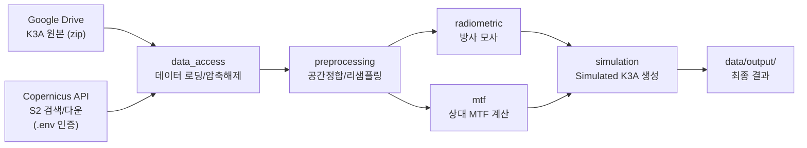

# K3A_S2_MTF 프로젝트 폴더 구조 설계

## 프로젝트 목적

**Kompsat-3A 영상을 Sentinel-2 영상으로 모사(Simulation)하는 파이프라인**

핵심 워크플로우:
1. K3A 영상과 100% 중첩하는 Sentinel-2 영상 검색
2. 방사 모사 (Radiometric Simulation)
3. 상대적 MTF 값 계산
4. 최종 Simulated K3A 영상 생성

---

## 사용자 피드백 반영 완료

| 항목 | 결정 |
|---|---|
| K3A 데이터 저장 | `data/raw/k3a/`에 **zip 파일**로 저장 |
| S2 데이터 접근 | **Copernicus Data Space API** 사용 |
| 인증 관리 | `.env` 파일 (`.gitignore` 필수) |
| 설정 파일 형식 | **JSON** |
| Jupyter 노트북 | **사용함** (`notebooks/` 디렉토리) |
| rules.md | **전면 교체 승인** → ✅ 완료 |

---

## 최종 확정 폴더 구조

```
K3A_S2_MTF/
│
├── rules.md                    # 프로젝트 코딩 가이드라인
├── requirements.txt            # Python 의존성
├── README.md                   # 프로젝트 설명서
├── .env                        # 환경 변수 (API 키, 경로 등) ※ Git 제외
├── .gitignore                  # Git 제외 파일
│
├── config/                     # 설정 파일 (JSON 형식)
│   ├── paths.json              # 데이터 경로 설정
│   ├── sensor_specs.json       # K3A/S2 센서 사양 (밴드, 해상도, SRF 등)
│   └── processing_params.json  # 처리 파라미터 (MTF 계수, 임계값 등)
│
├── src/                        # 소스 코드 (핵심 모듈)
│   ├── __init__.py
│   │
│   ├── data_access/            # [Step 0] 데이터 접근 및 로딩
│   │   ├── __init__.py
│   │   ├── gdrive_loader.py    #   Google Drive에서 K3A 데이터 로딩
│   │   ├── s2_search.py        #   Copernicus API로 S2 영상 검색 (중첩 영역)
│   │   ├── s2_download.py      #   S2 영상 다운로드
│   │   └── raster_io.py        #   GeoTIFF 읽기/쓰기 공통 유틸
│   │
│   ├── preprocessing/          # [Step 1] 전처리
│   │   ├── __init__.py
│   │   ├── coregistration.py   #   K3A ↔ S2 공간 정합 (좌표계 맞춤)
│   │   ├── resampling.py       #   해상도 리샘플링 (S2 → K3A 해상도)
│   │   └── roi_extract.py      #   관심 영역(ROI) 추출
│   │
│   ├── radiometric/            # [Step 2] 방사 모사
│   │   ├── __init__.py
│   │   ├── srf_matching.py     #   분광 응답 함수(SRF) 기반 밴드 매칭
│   │   ├── toa_reflectance.py  #   TOA 반사도 변환
│   │   └── rad_simulation.py   #   방사 모사 실행 (S2 → K3A 방사 특성 변환)
│   │
│   ├── mtf/                    # [Step 3] MTF 분석
│   │   ├── __init__.py
│   │   ├── edge_detection.py   #   에지 검출 (Knife-edge / Slanted-edge)
│   │   ├── mtf_calculation.py  #   MTF 곡선 계산 (LSF → ESF → MTF)
│   │   ├── relative_mtf.py     #   상대 MTF 계산 (K3A vs S2)
│   │   └── mtf_filter.py       #   MTF 기반 필터 생성 (PSF/커널)
│   │
│   ├── simulation/             # [Step 4] 최종 모사 영상 생성
│   │   ├── __init__.py
│   │   └── simulate_k3a.py     #   방사보정 + MTF 적용 → Simulated K3A
│   │
│   └── utils/                  # 공통 유틸리티
│       ├── __init__.py
│       ├── visualization.py    #   영상/그래프 시각화
│       ├── metrics.py          #   품질 평가 지표 (RMSE, SSIM 등)
│       └── logger.py           #   로깅 설정
│
├── notebooks/                  # Jupyter 노트북 (탐색/실험용)
│   ├── 01_data_exploration.ipynb
│   ├── 02_radiometric_test.ipynb
│   ├── 03_mtf_analysis.ipynb
│   └── 04_simulation_result.ipynb
│
├── data/                       # 데이터 디렉토리 ※ Git 제외
│   ├── raw/                    #   원본 데이터
│   │   ├── k3a/                #     K3A 원본 영상 (zip 파일)
│   │   └── s2/                 #     S2 원본 영상
│   ├── interim/                #   중간 처리 결과
│   └── output/                 #   최종 Simulated K3A 영상
│
├── tests/                      # 단위 테스트
│   ├── test_data_access.py
│   ├── test_radiometric.py
│   ├── test_mtf.py
│   └── test_simulation.py
│
├── docs/                       # 문서
│   ├── sensor_comparison.md    #   K3A vs S2 센서 비교표
│   └── methodology.md          #   방법론 상세 설명
│
└── scripts/                    # 실행 스크립트
    ├── run_pipeline.py         #   전체 파이프라인 한번에 실행
    └── run_step.py             #   개별 단계 실행
```

---

## 파이프라인 흐름도



---

## 다음 단계

rules.md 업데이트 완료. 다음 작업으로 진행 가능:
1. 폴더 구조 실제 생성 (빈 디렉토리 + `__init__.py` 파일)
2. `.env.example`, `.gitignore` 생성
3. `config/*.json` 기본 설정 파일 생성
4. 코드 구현 시작 (Step 0: data_access부터)
